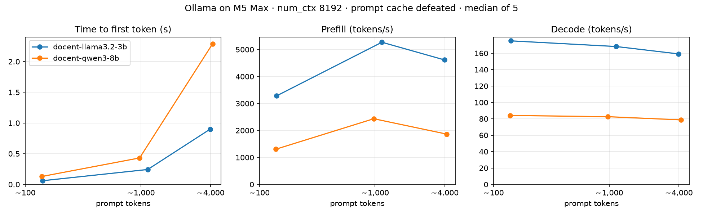

# docent-ai

A local-first assistant that answers questions about the Kubernetes docs, built in public one lab a week.
Everything runs on my laptop (Ollama on an M5 Max); tests run in CI with no model at all.

```bash
make install   # uv sync
make test      # unit tests, no model needed
make models    # build pinned Ollama model aliases
make bench     # token table + speed benchmark
```

## Week 1 — Hello, local LLM
A typed LLM client (`docent/llm.py`), a streaming CLI (`docent ask`), pinned model aliases
(`models/*.Modelfile`, `num_ctx 8192`), a token counter and an honest prefill/decode benchmark.

**Same text, different token bills** (`bench/tokens.py`, raw mode, special tokens subtracted):

| text | chars | llama3.2:3b tokens | qwen3:8b tokens |
|---|---:|---:|---:|
| English prose | 411 | 81 | 81 |
| Python code | 372 | 92 | 92 |
| Kubernetes YAML | 486 | 136 | 147 |
| JSON | 210 | 80 | 84 |
| `terminationGracePeriodSeconds` | 29 | 4 | 4 |
| Telugu sentence | 91 | 162 | 136 |

English packs ~5 characters per token, YAML ~3.5, Telugu ~0.6, so "4k tokens" is a different
amount of text for every model and language.

**Speed on an M5 Max** (`bench/speed.py`: median of 5 runs, one warm-up discarded, `num_ctx`
and `think` set explicitly, prompt cache defeated with a unique id at the start of every prompt):

| model | prompt tokens | time to first token | prefill tok/s | decode tok/s |
|---|---:|---:|---:|---:|
| llama3.2:3b | ~140 | 0.06 s | 3,284 | 175 |
| llama3.2:3b | ~1,150 | 0.24 s | 5,269 | 168 |
| llama3.2:3b | ~4,000 | 0.90 s | 4,616 | 159 |
| qwen3:8b | ~140 | 0.13 s | 1,306 | 84 |
| qwen3:8b | ~1,000 | 0.43 s | 2,434 | 83 |
| qwen3:8b | ~4,150 | 2.29 s | 1,864 | 79 |
| qwen3:8b, same prompt again (cache hit) | ~4,150 | **0.05 s** | skipped | 81 |



What I learned this week:
- Ollama sized the context window from free memory: 131k tokens, 11 GB for a 2 GB model. Pinned to 8k: 2.7 GB.
- Overflowing the window is silent: a 10k-token prompt into an 8k window lost its beginning, and the model confidently said there was no password.
- A cache hit turns a 2.3 s wait into 0.05 s, so a benchmark that repeats prompts measures the cache, not the model.
- Hidden costs: the chat template adds 3–20 tokens per message, and qwen3's thinking wrote 167 hidden words for a 42-word answer.

See [NEXT.md](NEXT.md) for what Week 2 picks up.
